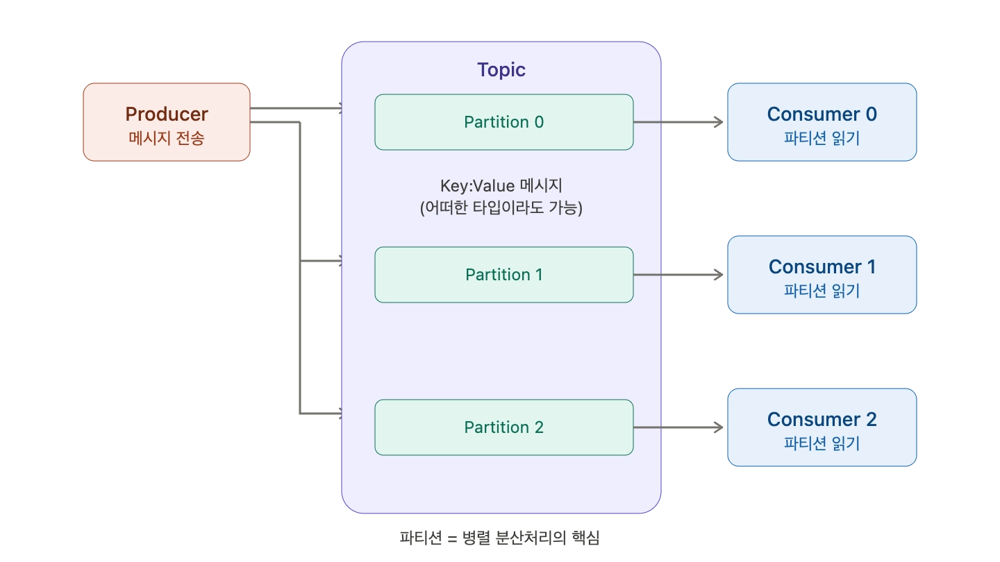
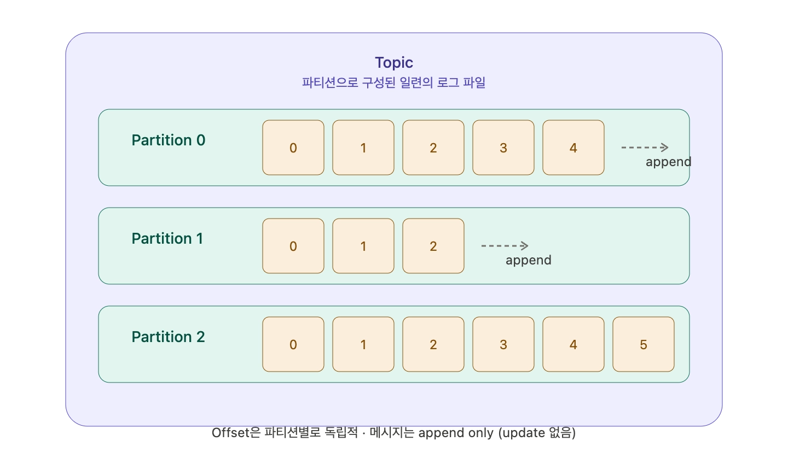
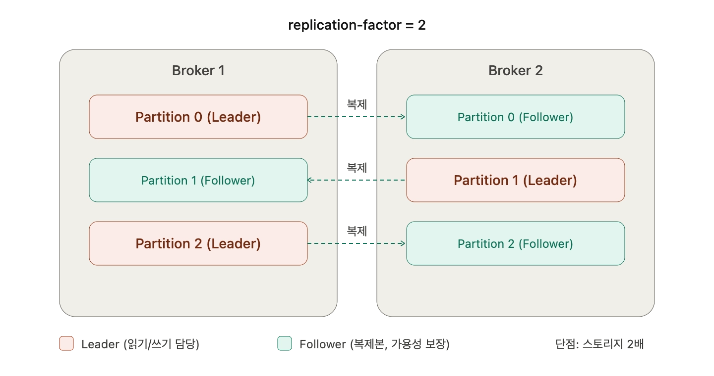

### Topic

토픽은 RDBMS의 table과 유사한 기능이다. 키랑 value 기반의 메시지 구조이고, 어떠한 타입이라도 가능하다.

Producer에서 메시지를 보내면 Topic에 전달이 된다. 연속적으로 발생하는 데이터를 저장하는 구조로, 메시지는 append된다. 추가적으로 write만 되고, 메시지를 보낼수록 증가된다. Update는 없다. 다 append이다.

토픽은 파티션으로 구성된 일련의 로그 파일이다. 여러 개의 파티션을 가질 수 있다.

### Partition

토픽은 개별 파티션으로 구성되어 있고, 컨슈머는 이 파티션을 가져와서 읽는다. 파티션도 테이블이라고 볼 수 있을 거다.

Topic의 Partition은 카프카의 병렬 성능과 가용성 기능의 핵심이다. 병렬이 매우 뛰어남.

개별 파티션은 계속 정렬되고, offset으로 불리는 일련번호를 할당받는다. offset은 파티션별로 독립적이다. 파티션별로 offset은 독립적이고 처음 offset은 계속 추가된다.

### Replication (가용성)

`replication-factor=2`로 하면 리더-팔로워 형식으로 가져가게 된다. 리더로 오면 팔로워에게 복제가 된다. 복제가 되면 가용성을 보장받을 수 있다.

복제를 하면 스토리지가 많이 드는 단점이 있다.

