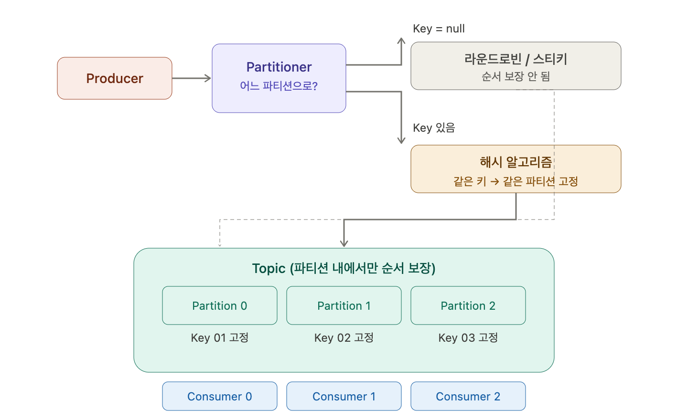

### Partitioner

프로듀서가 메시지를 보낼 때 어느 파티션으로 보낼지 결정하는 게 Partitioner이다. 메시지들이 어디로 가야 하는지 결정해주는 역할이고, 토픽의 어느 파티션으로 전송이 되어야 할지 미리 결정이 된다.

프로듀서는 브로커로 접속하면 브로커에게 메타데이터를 받는다. 라운드로빈으로 보낼지, 스티키 파티션으로 보낼지 전략이 선택되어 파티션별로 메시지가 전송된다.

### 메시지 순서와 병렬 처리

복수 개의 파티션이 있을 때, 컨슈머에서 읽어들일 때 전송 순서가 보장되지 않은 채로 컨슈머에 읽혀질 수 있다. 파티션이 2개면 병렬도가 2개, 3개면 3개이다.

카프카는 하나의 파티션 내에서만 메시지 순서를 보장한다.

### Key 기반 파티셔닝

키값을 가지는 경우, 메시지 키는 분산 성능 영향을 고려해 생성한다. 메시지 키값이 고유하게 식별하기 위함은 아니다.

특정 키값을 가지는 메시지는 특정 파티션으로 고정되어 전송된다. 해시 알고리즘을 거쳐서 키가 01이면 파티션 1번으로 가는 식으로, 해시 키를 거쳐서 들어간다. 키값에 따라 해시 알고리즘을 통과시켜서 어디 파티션으로 가야 할지 고정되게 들어갈 수 있다. 파티션 0번에 01은 고정이 되었다. 02도 보장이 된다.

### Consumer Group

컨슈머 그룹에 대해서 여러 개의 컨슈머를 가지고, 각 파티션당 컨슈머 하나에 붙는다. 보통 이런 식이다.

