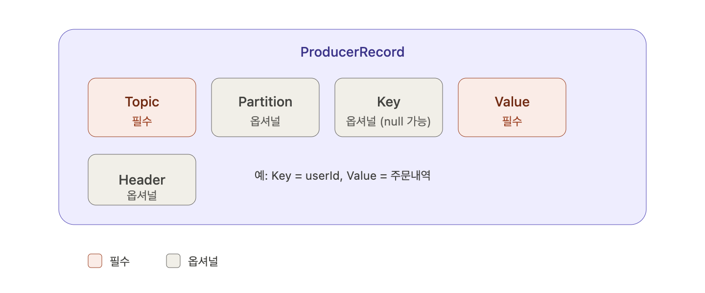
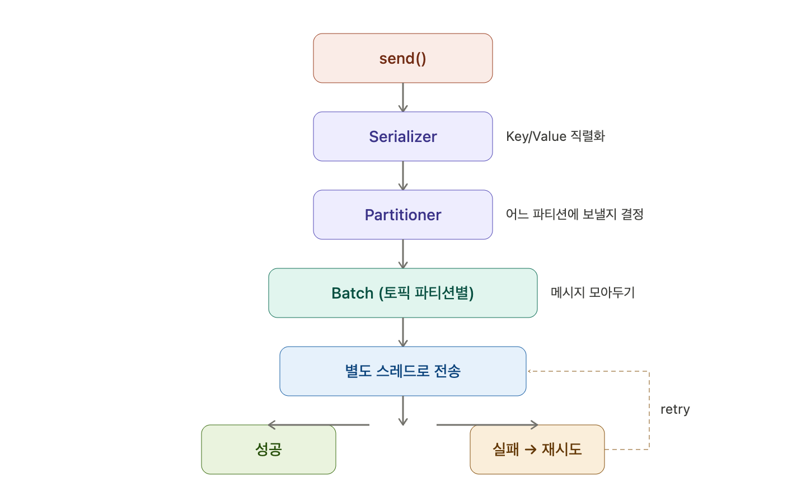

### Producer

Producer는 Topic에 메시지를 보낸다. 어느 파티션에 보낼지는 성능, 로드밸런싱, 가용성, 업무정합성 등을 고려해서 전략적으로 결정된다.

### 메시지 구조

레코드, 메시지, 이벤트는 다 같은 이름이다. ProducerRecord는 Topic, Partition, Key, Value, Header를 가지고 있다. 메시지의 주요 컨텐츠는 Key:Value 세트로 되어있다. 예를 들어 `userId : 주문내역` 같은 식이다.

레코드에 반드시 들어가야 할 것은 Topic과 Value이다. Key는 옵셔널하게 null이어도 상관없다. 하지만 Value는 있어야 한다.

### Producer 내부 흐름

원래는 프로듀서로 보내는 로직이 조금 더 복잡하다. Producer → send해서 Serializer 하고 Partitioner 한 다음에 토픽 파티션에서 배치를 하고, 별도의 스레드로 보낸 후에 다시 스레드 한다. 실패했냐 재시도할거냐 판단한 뒤 보내게 된다.

### Consumer

Consumer는 토픽에서 바로 메시지를 읽는다. 여러 개의 컨슈머로 구성될 경우 어떤 브로커의 파티션에서 메시지를 읽을지 결정한다.

컨슈머 역시 단순하지 않다. 컨슈머가 알아야 할 게 좀 더 많다.
