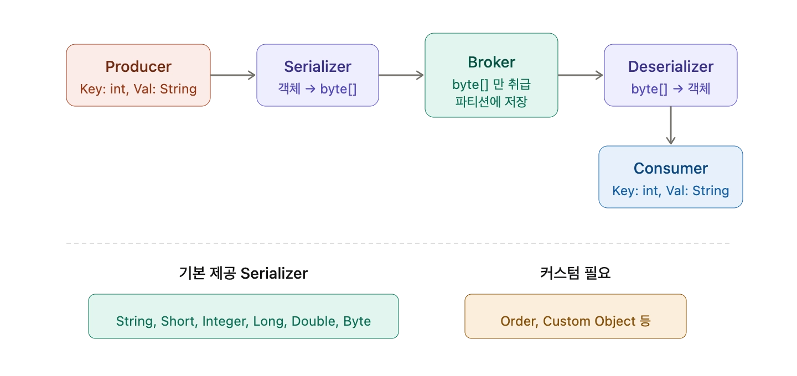

Producer와 Consumer 간에는 Serialized된 메시지만 전송이 된다. 브로커는 바이트 어레이만 취급한다. 토픽 파티션에 저장되는 것도 바이트 어레이 형태로 저장이 된다.

### 흐름

Producer에서 Key는 int, Value는 String이면 Serialize 해서 바이트로 직렬화하고, Consumer에서는 역직렬화를 한다. 바이트 어레이 형태로 변경된 객체가 직렬화된 바이트 어레이다.

Consumer는 일단 바이트 어레이 형태로 읽은 다음에 Deserializer로 역직렬화 한다. 객체 형태로 다시 변경한다. 복원시킨다.

### Java의 Serialization 개념

클래스와 객체는 인스턴스화 되면 메모리에 올라간다. Customer가 있고 private Integer id, private String name이 되면 Object에서 Serialize 시켜서 메모리로 읽을 수 있다.

파일에 Object를 write 하고, 이 파일을 네트워크 통해서 다른 시스템으로 보내고, 다시 파일로 받아서 파일을 Deserialization 한다. 파일-네트워크-파일까지 자동화하려면 String of bytes를 많이 쓴다. `byte[]`를 만들면 파일은 바이트만 읽으면 된다.

Serialization / Deserialization으로 시스템 투 시스템을 이동, 저장, 복원 자유롭게 수행된다.

### Kafka에서의 Serializer 설정

기본적으로 kafka-console-producer는 String이 들어오면 StringSerializer 해준다. 우리가 구현할 때는 명시적으로 적어줘야 한다. 이것을 바이트 어레이로 변경해줄 거다를 명시적으로 적어줘야 한다.

int면 IntegerSerializer, String이면 StringSerializer를 쓴다. 역직렬화도 Deserializer로 반대로 명시해줘야 한다.

### Kafka 기본 제공 Serializer

String, Short, Integer, Long, Double, Byte Serializer가 내장되어 있다. 나머지 Order나 Custom Object에 대해서는 커스텀으로 직렬화를 해주어야 한다.