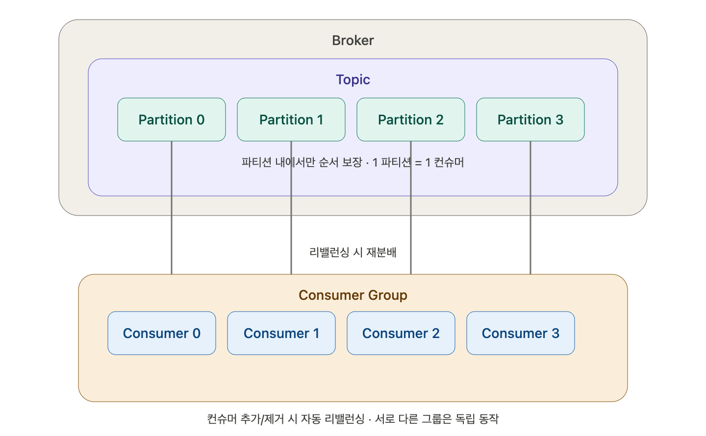

### Consumer Group, Consumer
컨슈머 그룹에 속하지 않는 컨슈머는 없다. 컨슈머가 있으면 무조건 컨슈머 그룹이 있다. 컨슈머는 단 하나의 그룹에만 속해야 한다.

### 파티션과 컨슈머 개수

파티션의 개수가 가장 중요하다. 파티션의 개수만큼 컨슈머의 개수를 동일하게 맞춰준다. 파티션이 4개면 컨슈머를 보통 4개 만들어준다.

파티션이 4개인데 컨슈머가 하나면 1차선이 4개의 차로 막혀서 느리게 가는 것과 비슷하다.

### 메시지 순서

프로듀서는 배치1, 배치2, 배치3 순으로 보내지만, 컨슈머는 그렇게 순서대로 읽지는 않는다. 순서는 보장이 되지 않는다. 어사인 전략이 따로 있다. 파티션 분배 전략, 어사인 전략 등이 있다.

### 파티션 할당과 리밸런싱

파티션의 레코드들은 단 하나의 컨슈머에만 할당된다. 하나의 파티션은 단 하나의 컨슈머에만 할당이 된다.

파티션을 사이좋게 나눠갖기 위해서 컨슈머 그룹 내에서 컨슈머끼리 특정 파티션에 대한 읽기를 병렬 분산할 수 있다. 컨슈머 그룹 내의 컨슈머에 리밸런싱이 발생한다. 그룹 내에서 컨슈머가 생성되면 리밸런싱이 발생한다. 리밸런싱이 되면 다른 곳에 갈 수도 있다.

### 컨슈머 그룹 간 독립성

동일한 컨슈머 그룹 내의 컨슈머들은 최대한 균등하게 분배하고, 서로 다른 컨슈머 그룹의 컨슈머들은 분리되어 독립적으로 동작한다.