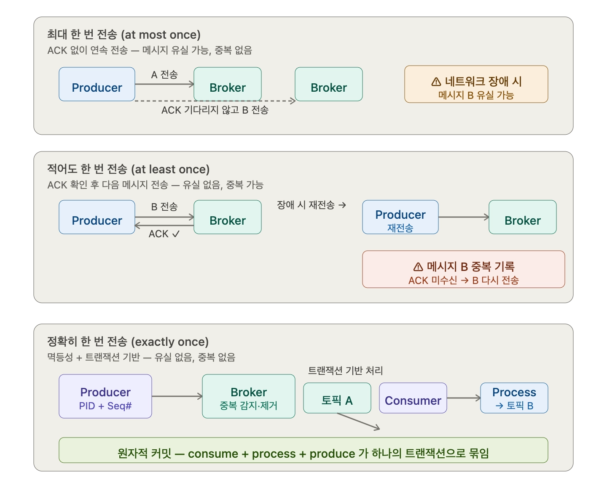

## 최대 한번, 적어도 한번, 정확히 한번 전송

### 최대 한 번 전송 (at most once)

ack 또는 에러 메시지 없이 다음 메시지를 연속적으로 보낸다. 프로듀서가 ack를 기다릴 필요는 없다. 네트워크 장애로 ack나 에러를 보내지 못해도 메시지 전송을 계속 한다.

유실은 있어도 중복은 없다. 가장 빠르지만 그만큼 메시지가 사라질 수 있다.

### 적어도 한 번 전송 (at least once)

ack를 받은 다음 메시지를 전송한다. 네트워크 장애로 ack나 에러를 보내지 못하면 재전송을 한다. ack를 받지 못한 프로듀서는 메시지 B를 다시 보내고, 메시지 B는 중복 기록된다.

메시지 소실은 없지만 중복 전송을 할 수 있다.

### 정확히 한 번 전송 (exactly once)

중복 없이 전송하는 것이다. 프로듀서의 메시지 전송 리트라이 시 중복을 제거한다. 두 가지 메커니즘으로 구현된다.

- *멱등성 (idempotence)**은 프로듀서마다 고유한 PID와 시퀀스 번호를 부여해서 브로커가 중복 메시지를 감지하고 제거한다. 리트라이를 해도 브로커가 이미 받은 메시지인지 판단해서 중복 저장을 막는다.

**트랜잭션 기반 전송**은 `consume → process → produce`를 하나의 원자적 트랜잭션으로 묶는다. 중간에 실패해도 전체가 롤백된다. 주로 토픽 A → Consumer → Producer → 다른 토픽에 write하는 파이프라인에서 사용된다. 이 흐름이 하나의 트랜잭션에 함축되어 있다.

|  | 메시지 유실 | 중복 전송 | 성능 |
| --- | --- | --- | --- |
| At most once | 가능 | 없음 | 가장 빠름 |
| At least once | 없음 | 가능 | 보통 |
| Exactly once | 없음 | 없음 | 가장 느림 |