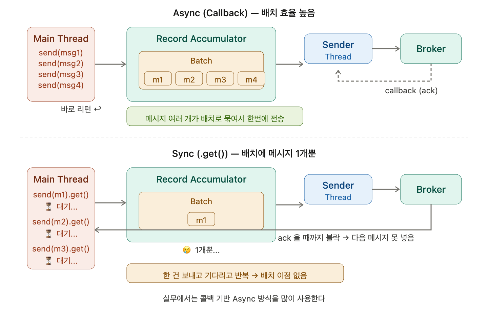

## Producer의 Sync와 Callback Async에서의 Batch

### send()는 기본적으로 비동기다

`send()` 메소드는 비동기이다. Batch 기반으로 메시지를 전송한다. for문을 돌리면 send 메시지는 바로 리턴이 된다. send로 메시지를 계속해서 집어넣고, 배치에 대한 조건을 만족하면 Sender 스레드가 가져간다. Sender 스레드가 배치들을 읽어와서 브로커로 보내주는 역할을 한다.

### Callback 기반 Async

Callback 기반의 Async는 비동기적으로 메시지를 보내면서 RecordMetadata를 Client가 받을 수 있는 방식을 제공한다. 여러 개의 메시지가 Batch로 만들어진다.

send가 바로 리턴되니까 for문에서 계속 메시지를 넣을 수 있고, Record Accumulator에 메시지가 쌓이면서 자연스럽게 배치가 구성된다. Sender 스레드가 이 배치를 가져가서 브로커에 보내고, ack가 오면 콜백으로 결과를 돌려준다. 메인 스레드는 블락 없이 계속 메시지를 넣을 수 있으니까 배치 효율이 높아진다.

### 동기 방식의 배치 문제

`RecordMetadata recordMetadata = kafkaProducer.send().get()` 과 같은 방식으로 개별 메시지별로 응답을 받을 때까지 block이 되는 방식이다. 메시지 배치 처리가 불가하다. 전송은 배치 레벨이지만 배치에 메시지는 단 1개뿐이다.

`.get()`을 호출하면 메인 스레드가 ack가 리턴될 때까지 대기한다. 리턴이 되어야 다음 메시지를 넣을 수 있기 때문에 Record Accumulator에 메시지가 쌓일 틈이 없다. 결국 Sender 스레드가 가져갈 때 배치에 메시지가 1개밖에 없는 상태가 된다. for문을 돌려도 한 건 보내고 기다리고, 한 건 보내고 기다리고를 반복하니까 배치의 이점을 전혀 살릴 수 없다.

### 정리

비동기는 send가 바로 리턴되니까 메시지가 Record Accumulator에 여러 개 쌓이고, 배치로 묶여서 한번에 전송된다. 동기는 `.get()`으로 매번 블락되니까 배치에 1개만 담긴 채로 전송된다. 그래서 실무에서는 콜백 기반의 Async 방식을 많이 사용한다.