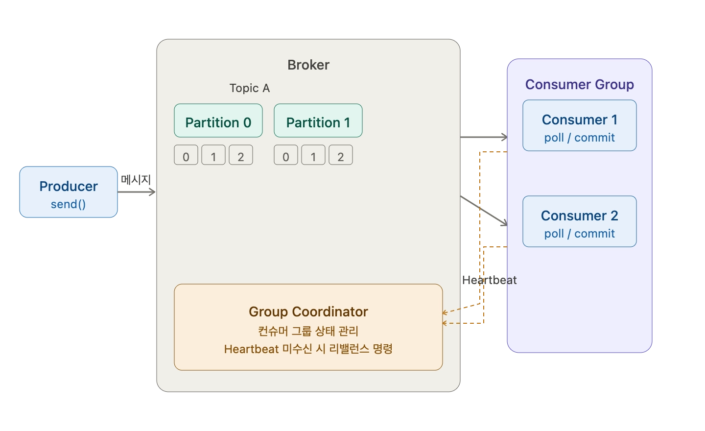

## Consumer의 주요 메커니즘 개요

### 기본 역할

브로커의 Topic 메시지를 읽는 역할을 수행한다. 모든 컨슈머는 고유한 그룹 ID를 가지는 컨슈머 그룹에 소속되어야 한다. 컨슈머 그룹에 소속되지 않고도 할 수는 있는데 흔하지는 않다.

개별 컨슈머 그룹 내에서 여러 개의 컨슈머들은 토픽 파티션별로 분배된다. 컨슈머는 보통 파티션 개수만큼 맞추는 게 최적의 요건으로 볼 수 있다.

### subscribe, poll, commit 로직

poll이 가장 중요하다. 읽어들이려는 토픽을 구독하면서 컨슈머가 만들어지고 등록된다. 토픽 A 입장에서는 컨슈머 그룹 1에 컨슈머가 들어왔구나 하고 파티션 정보를 넘겨준다.

poll 메소드를 이용해서 주기적으로 브로커의 토픽 파티션에서 메시지를 가져온다. 메시지를 가져왔으면 커밋을 통해 컨슈머 offset에 다음에 읽을 offset 위치를 기재한다.

### 내부 동작 구조

카프카 컨슈머는 내부적으로 Fetcher, ConsumerNetworkClient 객체와 별도의 Heartbeat 스레드를 생성한다.

Fetcher와 ConsumerNetworkClient 객체는 브로커의 토픽 파티션에서 메시지를 fetch 및 poll 수행한다.

Heartbeat는 살아있다고 계속해서 보내야 한다. 정상적인 활동을 Group Coordinator에게 보고하는 역할이다. Group Coordinator가 Heartbeat를 받지 못하면 컨슈머들의 리밸런스를 수행 명령한다.

