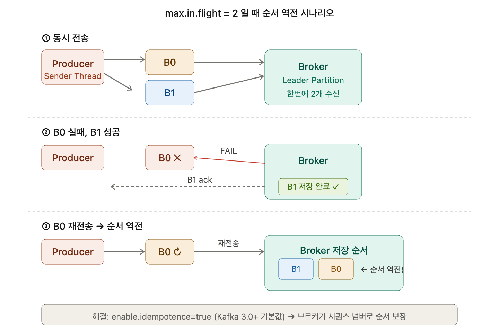

## max.in.flight.requests.per.connection 이해

### max.in.flight.requests.per.connection

Sender 스레드가 한번에 보낼 수 있는 메시지 배치의 개수이다. 기본값은 5이다. 카프카 프로듀서의 메시지 전송 단위는 배치다. 파티션별로 max.in.flight를 2라고 하면 한번에 두 개를 보낼 수 있다.

브로커 서버가 ack를 안 줬을 때 한번에 몇 개를 보낼 수 있냐를 지정하는 거다. 비동기 전송 시 한번에 보낼 수 있는 배치의 개수가 max.in.flight이다. 비동기라고 막 보내지 않고 ack가 올 때까지 기다린다. max.in.flight는 한꺼번에 보낼 수 있는 것을 제약시킨다.

이 값을 1로 설정하면 한번에 하나의 배치만 보내니까 순서가 보장되지만, 성능이 떨어지는 트레이드오프가 있다.

### retry와 메시지 순서 문제

카프카는 기본적으로 분산 시스템이다. 그래서 장애가 날 확률이 많다. 네트워크 장애는 생각보다 많다. 리트라이를 하는 것이 안전에 맞다. 카프카는 안정적이면서도 빠른 것을 주는 솔루션이다.

그런데 프로듀서 메시지 전송 순서와 브로커 메시지 저장 순서가 다를 수 있다.

B0부터 만들어졌다. B1이 그 다음에 만들어졌다. 한번에 B0, B1 같이 보내졌지만, B0가 어떤 이유에서 fail이 됐다. 그럼 B0에 대해서 재전송을 준비하고, 브로커는 B1은 잘 받았다. 이런 상황일 경우 B1이 먼저 저장되고 B0가 나중에 저장되면서 순서가 다르게 저장될 수 있다.

분산 시스템에서 리트라이는 무조건 할 수 있어야 한다. 프로듀서 전송 순서와 브로커의 저장 순서가 무조건 같은 상황일 경우는 많이 없다. 잘 안 발생하지만 만에 하나 발생한다면 서로 저장 순서가 어긋날 수 있다.

### Idempotent Producer로 순서 보장

Kafka 0.11 이후부터 `enable.idempotence=true`로 설정하면 max.in.flight가 5 이하일 때 순서 보장과 중복 방지를 동시에 해결할 수 있다. 브로커가 시퀀스 넘버를 추적해서 순서가 어긋난 배치를 거부하기 때문이다. Kafka 3.0부터는 `enable.idempotence=true`가 기본값이라 최신 버전을 쓰면 별도 설정 없이도 순서가 보장된다.

### 실무에서의 대응

보통 메시지에 저장 일시나 주문 일시를 넣어놓을 경우가 많다. 얼마든지 비즈니스 로직적으로도 해결이 가능하다. 이런 결함이 아예 없길 바라면 다른 시스템을 고려해야 하지 않을까.