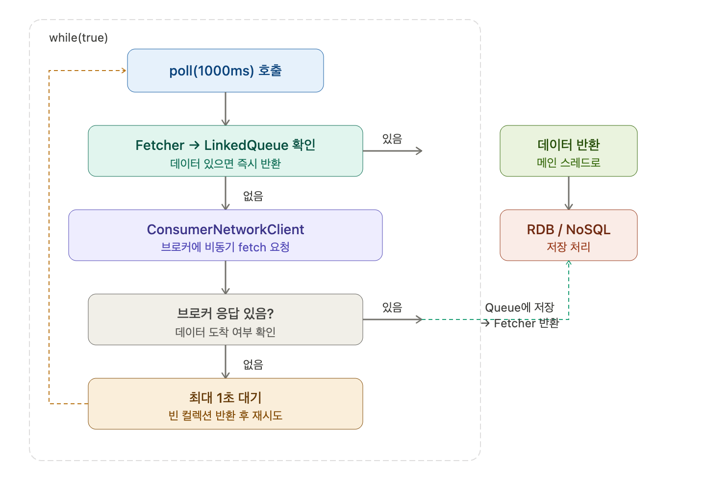

## Poll() 메소드 동작 메커니즘의 이해

### 주요 내부 객체

카프카 컨슈머는 내부적으로 아래 객체들로 구성된다.

Fetcher와 ConsumerNetworkClient가 브로커로부터 메시지를 읽어온다. SubscriptionState는 구독 상태를 관리하고, ConsumerCoordinator는 그룹 조율을 담당한다. HeartbeatThread는 별도 스레드로 동작한다.

### poll() 동작 방식

`poll(Duration.ofMillis(1000))`은 최대 1초 동안 동작한다. 브로커나 컨슈머 내부 queue에 데이터가 있다면 바로 반환하고, 없으면 1초 동안 브로커에 fetch를 계속 수행하고 결과를 반환한다.

### Fetcher와 ConsumerNetworkClient 역할

컨슈머가 poll을 호출하면 Fetcher가 먼저 내부 LinkedQueue를 확인한다. 가져올 게 있으면 바로 반환하고, 없으면 ConsumerNetworkClient에게 브로커에서 가져오라고 요청한다. 실제로 브로커에서 데이터를 가져오는 건 ConsumerNetworkClient이고, 비동기 I/O로 동작해서 결과를 LinkedQueue에 넣는다. Fetcher는 LinkedQueue에서만 가져오는 역할이다.

### poll 타임라인 예시

첫 번째 poll(1000ms)에서 Fetcher가 LinkedQueue를 확인했는데 없으면, ConsumerNetworkClient한테 가져오라고 시킨다. 이번에도 없으면 1초까지 기다린다. 0.1초에 완료됐다면 남은 0.9초를 기다리는 식이다. 첫 번째 poll 완료까지 1초.

두 번째 poll 완료는 1.1초, 세 번째 poll은 1.3초 이런 식으로 누적된다.

### 메인 스레드 처리

poll로 가져온 데이터를 RDB, NoSQL 등에 넣는 작업은 메인 스레드에서 수행한다. 출력 루프 자체는 얼마 안 걸리지만, 이런 저장 작업이 들어가면 상대적으로 시간이 오래 걸린다.

Fetcher도 없고 ConsumerNetworkClient도 가져올 게 없을 때 DB에 넣는 게 아니라, poll이 데이터를 반환한 이후에 메인 스레드에서 그 데이터를 DB에 넣는 거다. 즉 poll로 받아온 결과를 가지고 처리하는 것이고, 데이터가 없으면 빈 컬렉션이 반환되고 저장할 게 없는 상태가 된다.