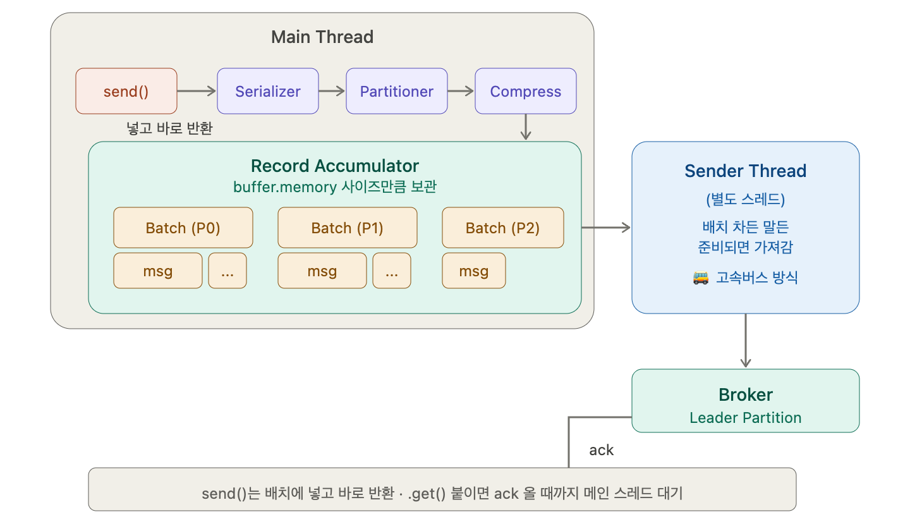

## Producer의 메세지 배치 전송의 이해

### 전송 파이프라인

`send()` 메소드를 호출하면 바로 전송하지 않는다. 내부적으로 다음 파이프라인을 거친다.

Serialize → Partitioning → Compression → Record Accumulator 저장 → Sender 스레드가 별도 스레드로 전송

### Record Accumulator

`send()` 호출 시마다 하나의 ProducerRecord를 입력하지만, 바로 전송하지 않는다. send는 배치에 집어만 넣고 바로 반환이 된다. 레코드는 Key와 Value로 되어 있고, Serializer에서 Partitioner를 거쳐서 Record Accumulator에 들어간다.

내부 메모리에 단일 메시지를 토픽 파티션에 따라 Record Batch 단위로 묶는다. 메시지들은 내부 메모리의 여러 개의 배치들로 보관되며, `buffer.memory` 설정 사이즈만큼 보관될 수 있다. 여러 개의 배치로 한꺼번에 전송될 수 있다.

### Sender 스레드

별도의 Sender 스레드가 Record Accumulator에서 배치 단위로 읽어서 브로커로 전송한다. Sender 스레드는 "준비되면 가져갈게"라는 입장이다.

배치 사이즈만큼 차든 말든 Sender 스레드는 가져간다. 고속버스도 다 안 차도 출발하듯이 Sender 스레드도 같은 방식이다.

### send()와 .get()의 차이

`send()`는 배치에 넣으면 바로 반환이 된다. `.get()`이 있으면 Sender 스레드가 데이터를 성공적으로 보내기 전까지는 메인 스레드가 대기할 수밖에 없다.

