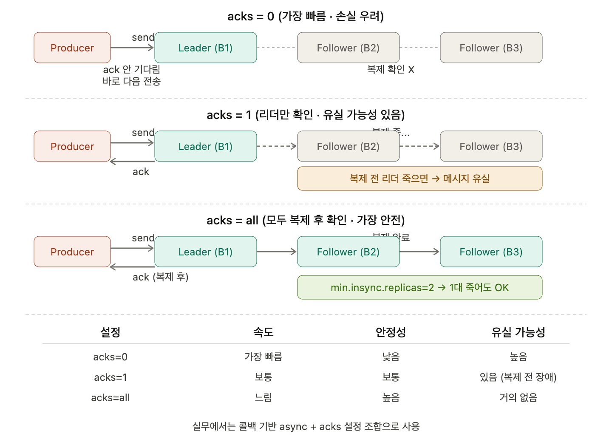

## Producer의 acks설정에 따른 send 방식

### 멀티 브로커 기본 구조

acks 설정을 알기 전에, 멀티 브로커를 먼저 알아야 한다. 프로듀서는 해당 토픽의 파티션의 리더 브로커에게만 보낸다. 브로커가 #1, #2, #3이 있으면 replication=3이면 리더가 팔로워 토픽들에게 복제한다. 팔로워들이 복제함.

### acks=0

가장 빠르게 전송이 가능하다. 프로듀서가 메시지를 보내면, 잘 받았지만 잘 받았다고 요청 전에 바로 다음 거를 보낸다. 메시지 손실의 우려가 크지만, 가장 빠르게 전송이 가능하다.

### acks=1

리더 브로커가 잘 받았다는 ack를 보내주지만, 뒤에 팔로워 복제는 확인하지 않는다. 복제를 받았다는 걸 확인받지 않고도, 일단 나는 잘 받았으니 ack를 보내줄게, 라는 의미다.

예를 들어 offset 999가 ack를 받고, 1000도 저장이 되고 잘 보내졌다. 그런데 999를 복제하는데 999는 복제가 잘 됐지만, 1000을 보낼 때 갑자기 브로커가 죽는다면 브로커2를 리더로 올린다. acks는 1000을 보냈는데 이제 1001을 보낼래, 그런데 1000을 받은 건 브로커1뿐이다. 브로커2는 1000을 복제받은 적이 없다. 중간에 유실됨.

### acks=all

메시지가 다 복제될 때만 ack를 보낸다. 대신 성능이 조금 느릴 수 있다. 하나가 죽어도 OK이다.

`min.insync.replicas=2`일 경우 하나 죽어도 OK인데, 브로커가 두 개가 죽어서 하나만 살아남았다면 에러를 뱉는다.

### 실무에서는

카프카를 썼다 하면 성능을 보고 대부분 쓰기 때문에 콜백 기반의 async를 많이 사용한다.

---

> sync인데 acks=0이라면?
> 

전송 후 ack랑 error를 기다리지 않는다. fire and forget이다. `.get()`으로 블락은 하지만, acks=0이라 브로커가 ack 자체를 안 보내니까 사실상 바로 리턴된다. 동기인데 받을 거를 0개로 처리해놓는 셈이라, sync의 의미가 거의 없어지는 조합이다.